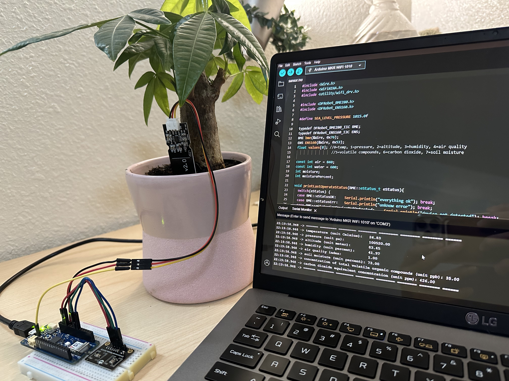
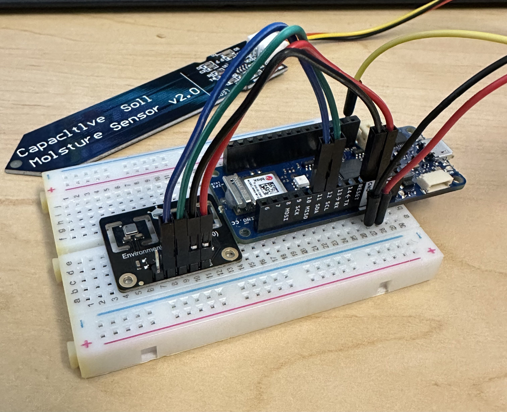

# MKR1010 Environmental Soil Sensor

Created a soil/enivornmental sensor using the Arduino MKR1010, DFRobot SEN0335, and a capacitive soil moisture sensor. Made to improve precision agricultre and can be used for home plants, gardens, ect.
- Measures temperature, soil moisture, humidity, CO2, altitude, AQI, pressure, and volatile organic compounds. 

    </a>
    </a>

